# Healthy Food Club
The "Healthy Food Club" is a community that hosts cooking sessions with brief health-related lectures and introduces alternative menus to promote a healthier lifestyle.  
  
During our activities, we strive to raise awareness about the prevalence of chemicals in our lives and their impact; with special focus on food additives, fertilizers, pesticide, and those regulations, to monitor them for a safer society and healthier life collectively.

## Live site

**[Live site >> https://atsukocoffey.github.io/healthy-food-club/](https://atsukocoffey.github.io/healthy-food-club/)**

## Table Of Contents
1.	[ UX DESIGN ](#ux)
2.	[ EXISTING FEATURES ](#features)
3.	[ FEATURES LEFT TO IMPLEMENT ](#featureleft)
4.	[ TECHNOLOGY USED ](#tech)
5.	[ TESTING ](#testing)
6.	[ BUGS ](#bugs)
7.	[ DEPLOYMENT ](#deployment)
8.  [ CREDITS ](#credits)
9.  [ CONTENT ](#content)
10. [ ACKNOWLEDGEMENTS](#acknowledgements)

# UX DESIGN

## 1. Strategy Plane
### Target users 
1.	Young people who are about to start living independently, as well as their parents
2.	Everyone who cares about food additives, health and simply enjoys cooking.

### User value 
1.	Users can access and learn crucial information that could have an impact on their health and well-being.
2.	Users can find a community which promotes everyone’s health through lectures and cooking lessons.
3.	Users can learn alternative cooking knowledge to avoid potentially dangerous food additives and unnaturally excessively processed food.

### Difference from competitors and substitutions
1.  The "Healthy Food Club" is not just recipes, but has more emphasis on learning.
2.  The cooking menu for the session is aligned with the lecture content, making it more practical.

## 2. Scope Plane 
### General user stories
*	As a user, I want to clearly understand what services are offered on this website.
*	As a user, I want to be able to easily navigate through to find contents.
*	As a user, I want the website to work on different devices and formats that I use.
*	As a user, I want a simple sign-up process allowing me to select my preferred option.
*	As a user, I want to feel that healthy cooking is interesting and not difficult.
*	As a user, I want to see articles that offer a variety of perspectives on health to increase my awareness and knowledge.

### Target users and who are interested in this website
*	As a user, I want to find out when the next cooking session is and clearly identify what the lecture subject will be.
* As a user, I want to find out what kind of people are organising the "Healthy Food Club" and whether they are trustworthy or not.
* As a user, I want to find out the schedules of future sessions.

### The website owner stories
*	As a site owner, I want to gather people for cooking & lecture sessions.
*	As a site owner, I want to convey clearly who we are and our purpose, to give users a sense of trust and confidence.
*	As a site owner, I want to share useful information and food science studies.
*	As a site owner, I want to encourage people’s awareness about chemicals in our life.
*	As a site owner, I want to inform and educate about European and national regulations on food additives.
*	As a site owner, I want to provide inspiration for alternative cooking ideas.
*	As a site owner, I want to convey clearly that the "Healthy Food Club" is not just about recipes and cooking.

## 3. Structure Plane

* The website should have a Navigation menu that is consistent across all pages.
* The website should have a fixed footer to access anytime to see this site's SNS.  
* The website should give the user a way to contact through a form.
* The website should have breadcrumbs to help users feel a strong sense of place and also give access to previous pages when it expands to become a larger website.
*	The website should have hover interaction for links, abbreviation, and tooltips with additional information to enhance user experience.
* The landing page should show what this site is offering intuitively.
* The Info page should have a variety of articles that are categorized by different perspectives.
* Burger icon is commonly used on smaller screens, so using this convention suits users' expectations.
*	The Sign-up page submit button should be clearly visible and interactive when the mouse hovers over it. 

## 4. Skeleton Plane

### Wireframes

For the mobile screen wireframe, I simply lined up important and necessary information under the flow of UX design strategy as I thought there wasn't much excess spaces.  

Mobile - 320px - Wireframe

  

I planned consciously to create contrast in sizes, information, and images for the tablet screen wireframe.  
Also I placed paragraphs diagonally on the layout of the useful information page to use the space more playfully.  

For PC monitor wireframe, I wanted to fit the contents for any width using flex box for the large monitor size layout.   

Tablet - 768px - and PC - 1440px - Wireframes

  

## 5. Surface Plane

### Colour
At the planning stage, I chose this colour scheme, which has a healthy, lively, clear and optimistic feeling, from the Adobe colour website. [TECHNOLOGY USED - Adobe Color API](#tech) 
  

However, using only these colors couldn’t provide enough contrast, so I adjusted the color scheme as below.  
  

### Typography

I selected "Poiret One" for the “Healthy Food Club” Logo from Google font API. It is attractive and has sharp features and it’s not too heavy.  
I was considering using "Quicksand" for the best readability, however our target users are young people and since it’s not a huge business website so a little bit unique font like "Josefin Sans" might appeal well to this unique community. [TECHNOLOGY USED - Google Fonts](#tech)  

* "Poiret One"  
  

* "Josefin Sans"  
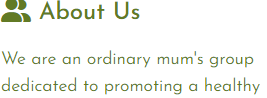

# EXISTING FEATURES

## The Header And Navigation Bar

The header, with the logo, is the face of the website. So I chose the strongest colour in my colour scheme for appeal, along with unique logo. This header includes the navigation bar which is fully responsive to all sizes of devices and it swaps to the toggle button to hide and show navigation links for smaller screen sizes, less than 768px width. I borrowed this toggle button technique from “Love Running” project in Code Institute LMS. [Credit - Code Institute learning material](#credits-content)  
The navigation bar has links to the logo, home page, information page and sign-up page and also has an easy to recognise icons.  
This feature is on all three pages and is identical in each page to allow for easy navigation.

## The Landing Page Hero Image

The landing hero image is really important as it should convey clearly the website purpose and show the atmosphere of this community, I am happy that I could find out a picture of a smiling girl preparing food in the kitchen. I used the CSS animation technique which I learned at the "Love Running" (Deprecated version) project to enlarge this background image.  [Credit - Code Institute learning material CSS animation](#credits-heroanime) , [Bugs - Code Institute learning material CSS animation](#bugs-heroanime)

## Upcoming Session Info Section

This section Informs about the next cooking session with a link to the session schedule page.  
This section is deliberately placed just under the hero image with outstanding background colour to be visible in the first loading view angle. The reason is that this info shows clearly what activities exactly the “Healthy Food club” is offering in this website.  

About this coding part, I consider using the `<figure>` element for an image since it is a part of the other page's content also it contains independent information. At same time, I wanted to use the `<picture>` element for responsivity though I wasn't familier with these codes so referenced other websites.[Credit - stackoverflow, perplexity](#credits-figure)

## About Us Section

Introduction about us and our purpose to give user feel confidence. Also if users live around Athlone town, we’d like to let them know this community session is being held at Technological University of the Shannon (TUS) where anyone can come.

## Article YouTube Section

This section shows a health related video that made by WHO, it promotes the overview of healthy life styles. I am aiming this will pique user’s interest and redirect them to the information page.

## The Footer

The footer section includes links to the relevant social media sites. The links will open to a new tab to keep this website open and allow easy navigation for anytime user can visit the social media sites.

## Breadcrumb
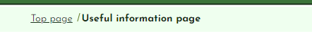

This feature lets users know which page they are on, giving a strong sense of place. It will be important if the site becomes larger.

## Information Page

This page is for the varieties of health information, they are categorised and present some leading text that explains what kind of information in here. There are only 4 categories at the moment with sample pictures, however this page will be expand over the time with more information. 

### Cooking basic knowledge
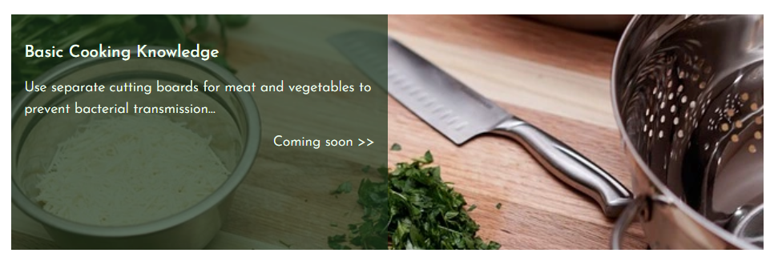

This category is for beginners ( young people who don’t have much cooking experiences ). Talk about tips like “Use different cutting board for meat and vegetables - preventing bacterial transmitting”…

### Healthy gut

This category is talking about our microbes which we can't see exactly but there're a lot of studies published and spotlighting these areas.  
This is a kind of general knowledge for who's interested in our body systems.

### Study on food additives and sickness

This category Introduces some studies on how our food development activities, such as excessive refining of ingredients or breeding improvement, can actually cause illness at the genetic level.  
I'd like to find the sources from Academic papers and public trusted information.

### Tips and tricks! 
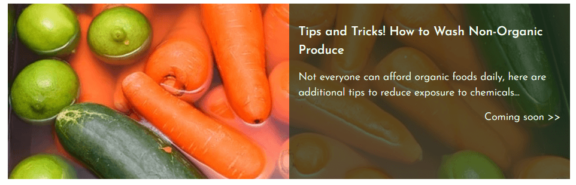

This category is for those who have just become interested in, but feel expensive or difficult. It shows the first easy steps to start.

## The Sign-up Form
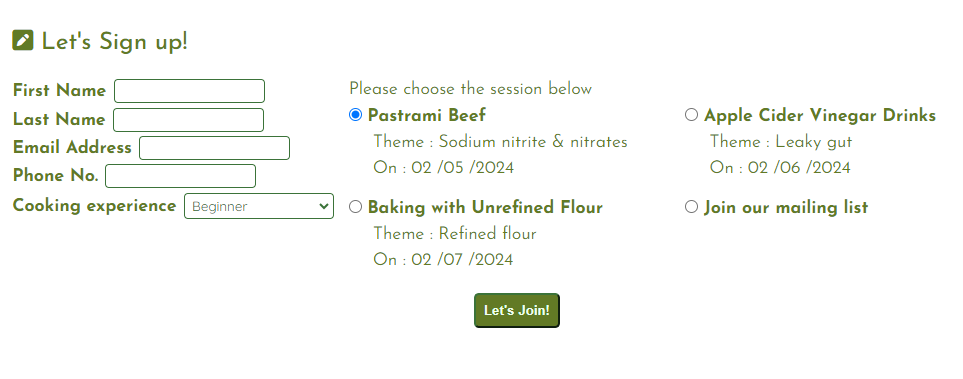

The sign-up form is interactive for user experience with mouse hovering colour, also submission button has same function with changing background colour. This section will allow users to get signed up along with specifying which session they would like to take part in or join the community mailing list. The user will be asked to submit their full name and email address for required information, phone number and cooking experience inputs are optional information.  
My mentor Alan taught me `pattern` attribute for this form inputs. This can prevent incorrect user inputs to submit. ( Credit section )

* First name, Last name : Texts only
* Phone number : Numbers only
* Email address : Need "@" mark

## Session Schedule
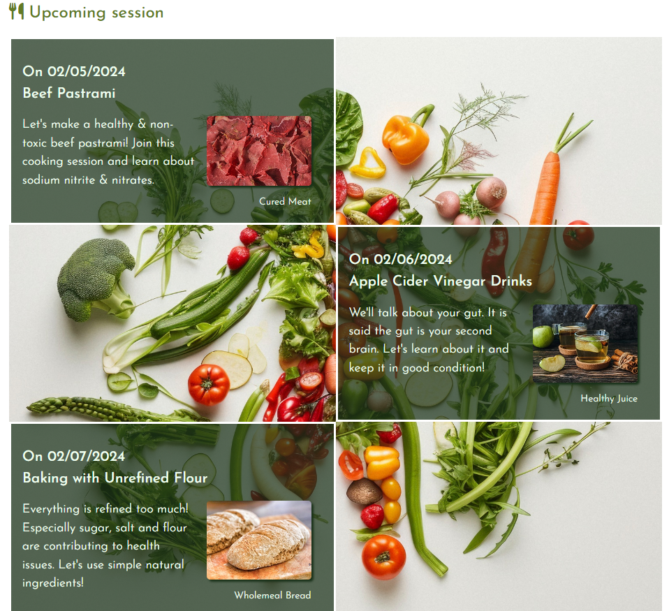

This feature informs future session dates, lecture titles and cooking menus with pictures. 

## Where To Find us

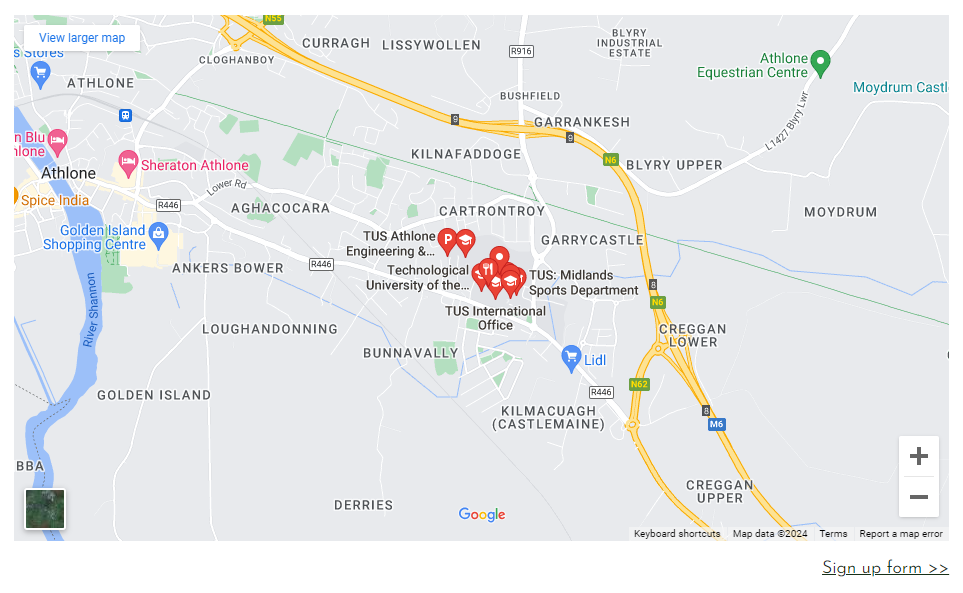

This feature is showing contact information and map of the venue.  
Added a link under the contact information section, I want to lead users back into the form section again.

I had a problem with google map, Lighthouse auditing told me about third party cookies in this map. [Bugs](#bugs) 

# FEATURES LEFT TO IMPLEMENT

## Information Architecture (IA)

In the info page, categories and articles will be expanding over time, so new pages will be created in each category folder for organizational purposes. Or if possible, develop the system using a technology like DOM to generate HTML pages by coding. 

## Online Session Feature

For future growth, an online session feature might be good idea for meeting people who live far away from Athlone town. Also it might be better for new users who want to listen to lectures only or just learn the cooking part to feel free to join in.

------------------------------------------

# TECHNOLOGY USED

* HTML
> Used to structure my webpages  

* CSS
> Used to style and add layout  

* GitHub 
> Used for our project's platform 

* GitPod 
> Used as my  Integrated Development Environment (IDE) system

* Font Awesome
> Used for all the icons in this project  

* Google Fonts
> Used for all the fonts used in this project and to compare potential fonts.  

* Google Map - MAPS.IE 
> Used for the map of the venue in "Where to find us" section

* tinify - Smart WebP, PNG and JPEG Compression for Faster Websites
> Used for compress all the image files

* FreeConvert - WebP Converter
> Used for generating webp format

* Am I Responsive? 
> Used for creating responsivity example image

* favicon.cc
> Used for creating original favicon icon

# TESTING

**Testing for links and Form**
| Test |Outcome  |
|--|--|
|All links on Navigation lead to their correct pages| OK |
|More information >> leads to the each target pages| OK |
|Footer social links all lead to their respective social media sites | OK |
|Contact form submits when all criteria is filled correctly| OK |
|User prevented from submitting form without correct elements| OK |
|Form Validation presents when incorrect input type is entered | OK |

**Testing for responsiveness**
| OS | Browser | Test | Outcome |
|--|--|--|--|
| Windows | Chrome | All three pages display correctly on screens larger than 1024px | OK |
|  |  | All three pages display correctly on screens larger than 768px | OK |
|  |  | All three pages display correctly on screens larger than 320px | OK |
|  |  | All three pages display correctly on screens smaller than 320px | OK |
|  | Edge | All three pages display correctly on screens larger than 1024px | OK |
|  |  | All three pages display correctly on screens larger than 768px | OK |
|  |  | All three pages display correctly on screens smaller than 768px | OK |
|  | Firefox | All three pages display correctly on screens larger than 1024px | OK |
|  |  | All three pages display correctly on screens larger than 768px | OK |
|  |  | All three pages display correctly on screens smaller than 768px | OK |
| Mac | Chrome | All three pages display correctly on screens larger than 1024px | OK |
|  |  | All three pages display correctly on screens larger than 768px | OK |
|  |  | All three pages display correctly on screens smaller than 768px | OK |
|  | Safari | All three pages display correctly on screens larger than 1024px | OK |
|  |  | All three pages display correctly on screens larger than 768px | OK |
|  |  | All three pages display correctly on screens smaller than 768px | OK |
|  | Firefox | All three pages display correctly on screens larger than 1024px | OK |
|  |  | All three pages display correctly on screens larger than 768px | OK |
|  |  | All three pages display correctly on screens smaller than 768px | OK |

## W3 Validator

* Top page - index.html  
  

* Information page - info.html  
  

* Sign-up page - signup.html  
  

## W3 CSS Validator

* Style sheet - style.css
  

## Google Lighthouse Testing

* Top page - index.html  
  

* Information page - info.html  
  

* Sign-up page - signup.html  
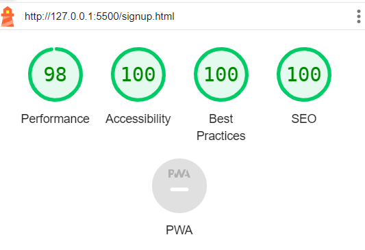  

# BUGS

## Header

My header nav toggle button was missing in the small screen size view. Then I found it was caused unexpected spaces around the title and the toggle button. It took a long time to find out what was happening though it was a good lesson to use the Google dev tool to inspect the CSS. I found my mistake with `Flex justify-content` was `space-around`, I meant to set `space-between`. 
  
Solution : Fix CSS `Flex justify-content` `space-around` to `space-between`

## Youtube-iframe Video

I struggled with figuring out how to set the video height automatically to fit the screen size. After tried and failed, I found a good technique that involves using padding-bottom with the ratio of the video width at stackoverflow.   

Solution : Set parent `
 padding-bottom ` the Youtube video size ratio 56.25% (16:9)

Youtube iframe height technique - stackoverflow >> 
  

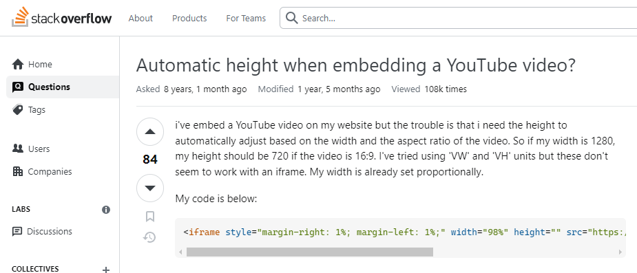  
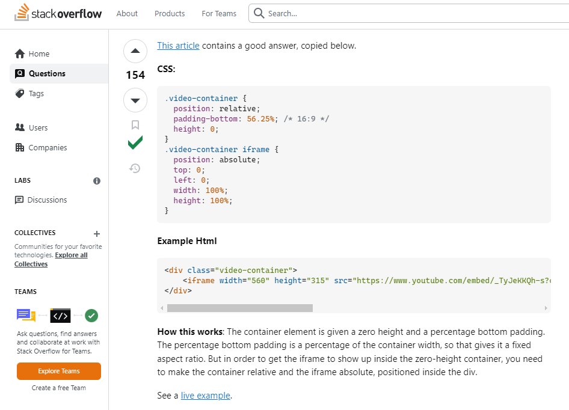

## Youtube-iframe Align Center

I struggled again to set this `<iframe>` `align:center`, without using `text-align` of `flex` to the parent `<article>` element or outer `
` element’s properties setting. This simple and fantastic technique persuaded me very well.  

Solution : Add `display: block` to the  `<iframe>`

Youtube iframe align center technique - stackoverflow >> 
  

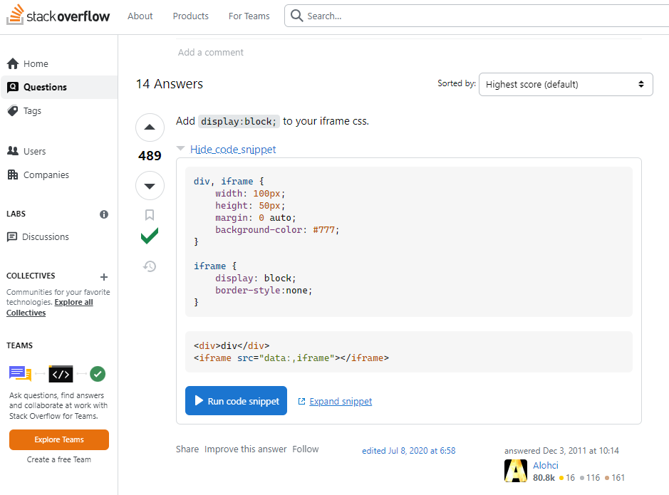

  

## Hero Image CSS Animation Scale 1 to 1.1 

I realised that this CSS animation caused excess space around the page as the hero image was literally enlarged by CSS.  
I was too excited to use this technipue to check carefully the parents `
` setting.  

Solution : `overflow: hidden` for outside `
`  

Hero image CSS animation scale 1 to 1.1 - "Love Running" walkthrough project (deprecated) >> 
  

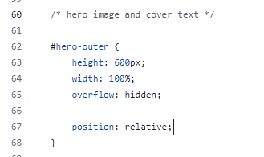  

## Youtube Video Optimizing For Lighthouse
Google Lighthouse audit told me that the YouTube Java Script is unnecessary and it’s better to remove it for faster loading. I searched about it and doubt if it’s true, I think it’s necessary when users start a video.  
Alternatively we can stop reading Java Script when the page is loading, using the `source=doc` attribute.  

Solution : Put the HTML link element inside the `source=doc` attribute 

Youtube video optimizing for lighthouse - stackoverflow >> 
  

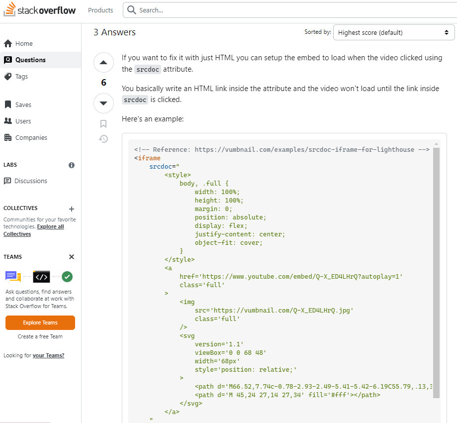

## Google Map – Remove Third-party Cookies

At beginning I had five third-party cookies related to google map. This cause SEO score of Lighthouse audit not high - around 70. After looked around the solution, I found this “ Prepare for third-party cookie restrictions “ article, I consider to sign up to google map API for cookie-less map, however I had to register my credit card which I wasn’t willing to. Therefore I had just tried to set my browser’s cookie blocked, and get the map URL from other map website. ( I got from MAPS.IE - My mentor showed me this website in my second project meeting - ) In this way I can audit Lighthouse with no third party cookie problem. However this cookies warning appeared again after my browser’s third-party cookies on.  

* [Link - Google Map remove third-party cookies](https://developers.google.com/privacy-sandbox/3pcd?utm_source=lighthouse&utm_medium=devtools "Google Map – remove third-party cookies")  
* [Link - MAPS.IE](https://www.maps.ie/ "MAPS.IE")

# DEPLOYMENT

> "Deployment" in web application development refers to the process of making a web application available for end users to access on the internet.  

1. Log in Git hub and access to purpose repository.
2. Click on 'Settings'.
3. On the left-hand sidebar, click on 'Pages'.
4. Source is 'Deploy from Branch'.
5. Select 'Main' branch.
6. Folder is 'root'.
7. Click 'Save'.
8. Click on 'Code'. After a few minutes refresh your repo.
9. On the right-hand side, in the Environments section, click on 'github-pages'.
10. Deployments page click the link to see the live site.

# CREDITS

## Code references

### CSS `[attribute="value"]` Selector

I leaned this selector at “Love Running” walk through project, using this for button’s functions. For making it my tool, I checked at W3schools website for further more information.
* [Link to W3school website - CSS Attribute Selectors](https://www.w3schools.com/css/css_attribute_selectors.asp "CSS Attribute Selectors")

### Meta Element `<meta http-equiv="X-UA-Compatible" content="IE=edge">`

I researched that what is this meta tag for, I guess we might not need this tag anymore though, just in case for the people who still using old version of IE, it might be better to help them.   

Meta Element X-UA-Compatible - stackoverflow, perplexity

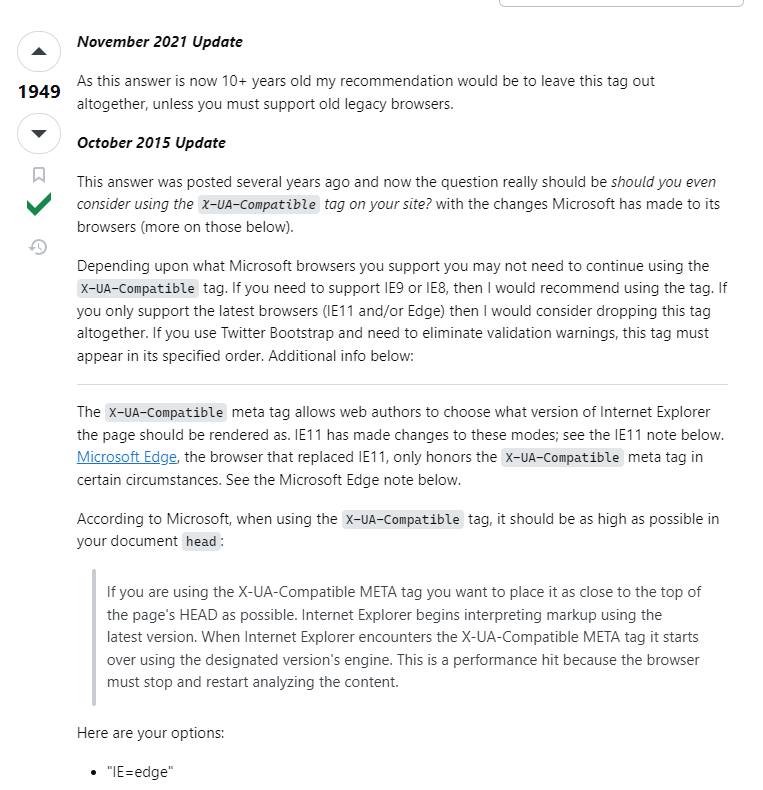
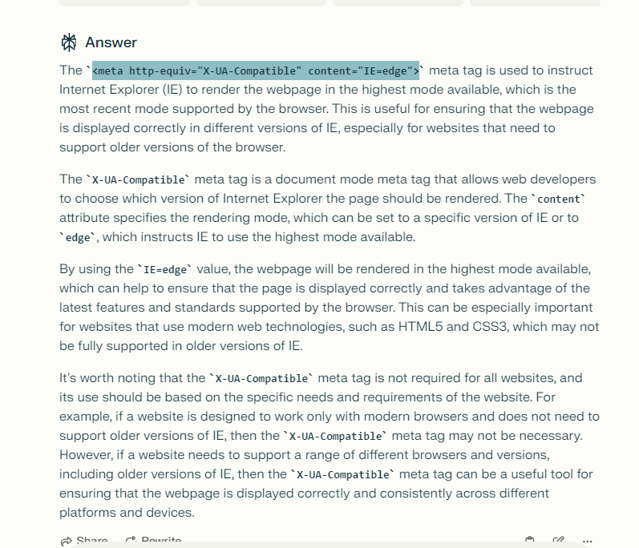

### Figure And Picture Element 

In the upcoming session section, I consider using the `<figure>` element for an image since it is a part of the other page's content also it contains independent information. At same time, I wanted to use the `<picture>` element for UI responsivity. But I wasn’t familiar with both elements to use so I looked for some hints around but couldn’t find out using both. I asked perplexity whether I could include picture element in the figure element. It seems no problem to include it. 

Figure And Picture Element - stuckoverflow, perplexity

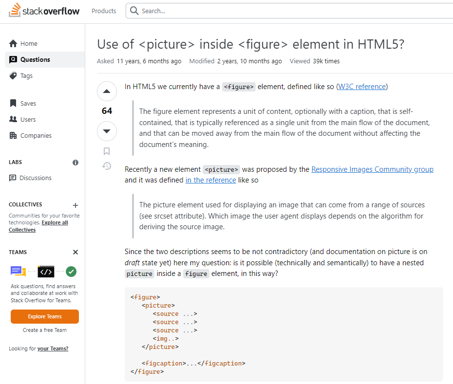
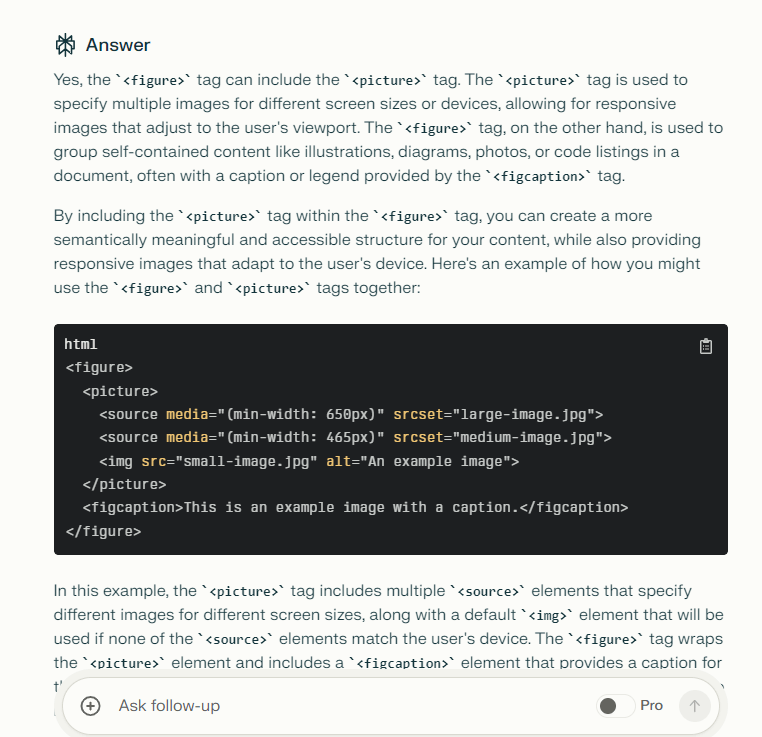

### Hero Image CSS Animation Scale 1 to 1.1 
When I learned this css animation technique through the “Love Running” project in Code Institute, I was amazed to discover that I could create animation without Java Script, which was common 20 years ago. 

Hero Image CSS Animation - “Love Running” project in Code Institute

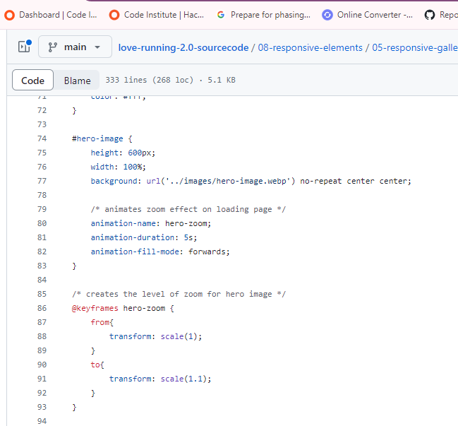

### Breadcrumb
I looked for what is suitable element for the breadcrumb links. In W3 website the answer was `<nav>` and using aria attribute for describing the location so I referred this css code.  

Breadcrumb - W3school

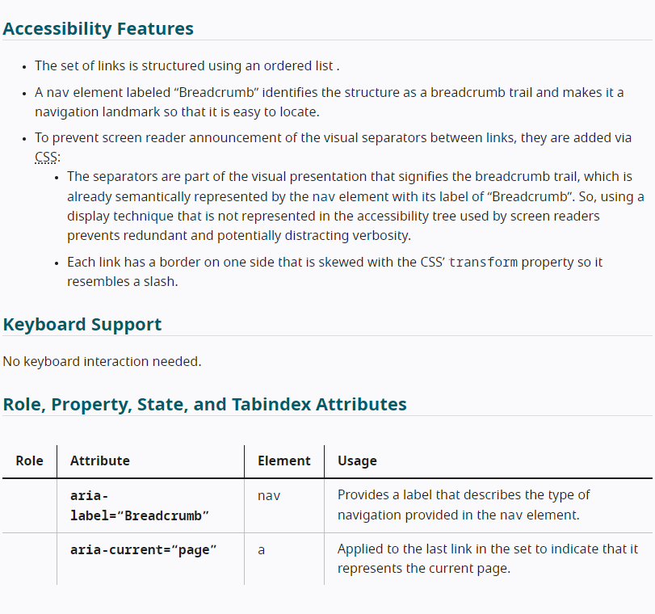
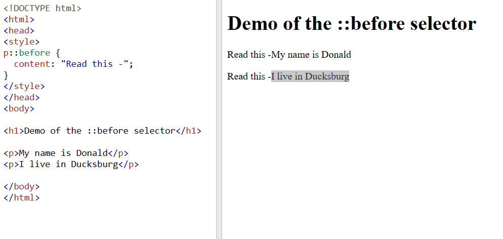

### Form  Autocomplete Attribute
Lighthouse validator suggested me to use autocomplete attribute for form, and I found this is really helpful for user.  

* [Link to MDN website - Form autocomplete attribute](https://developer.mozilla.org/en-US/docs/Web/HTML/Attributes/autocomplete "Form autocomplete attributer")

### Form Input Pattern Attribute
My mentor Alan taught me about this `<input>` pattern attribute for preventing invalid form data to submit.
EG. for alphabet only and 3 letters `pattern="[A-Za-z]{3}"`  

* [Link to W3schools website - Form input pattern attribute](https://www.w3schools.com/tags/att_input_pattern.asp#:~:text=The%20pattern%20attribute%20specifies%20a,pattern%20to%20help%20the%20user "Form input pattern attribute")

### Hero Image Optimizing For LCP
The hero image is not a small size image. After I read this article, I tried to optimize the reading time of the hero image using `<link rel="preload">’ for increasing LCP score.  

* [Link to web.dev - Optimize Largest Contentful Paint](https://web.dev/articles/optimize-lcp?utm_source=lighthouse&utm_medium=lr#optimize_when_the_resource_is_discovered "Optimize Largest Contentful Paint")

## Content references

### Code Institute Learning Material
[Code Institute Full-Stack Software Development Program](https://codeinstitute.net/?nab=0 "Code Institute Full-Stack Software Development Program")

### Adobe color API  
[ Adobe Color EXPLORE 'food' keyword ](https://color.adobe.com/search?q=food "Adobe Color EXPLORE 'food' keyword")

### Youtube: 
A healthy diet, a healthier world (WHO)  
[A healthy diet, a healthier world (WHO) ](https://www.youtube.com/watch?v=XMcab1MFaLc "A healthy diet, a healthier world (WHO) ")

### Map of TUS  
[https://maps.app.goo.gl/yFF4T7ChemuH2YJt5](https://maps.app.goo.gl/yFF4T7ChemuH2YJt5)

### perplexity
> Used for general questions

### MDN, W3schools
> Used to research codes

## Editing and proofreading
Since I am not native Irish I asked my family for help with more natural phrasing. [ACKNOWLEDGEMENTS](#acknowledgements)

## Imagery

* Hero image  
<a href="https://www.freepik.com/free-photo/young-smiling-woman-making-bruschetta-with-healthy-ingredients-while-preparing-food-kitchen_25777232.htm#fromView=search&page=1&position=49&uuid=0bc03e1b-f752-44c6-9880-1b484845ce49" width="500">Image by Drazen Zigic on Freepik</a>

* Picture pastrami beef  
<a href="https://www.freepik.com/free-photo/sliced-beef-pastrami-pastrami-with-turkish-bacon-closeup-top-view-traditional-turkish-food_37833736.htm#query=pastrami&position=0&from_view=keyword&track=sph&uuid=26cf64d1-d161-45da-a382-231c4d0c2ee6" width="300">Image by ededchechine on Freepik </a>

* A cutting board and a knife
Image by <a href="https://pixabay.com/users/rambling_roy-29593818/?utm_source=link-attribution&utm_medium=referral&utm_campaign=image&utm_content=7471627">Roy Stephen</a> from <a href="https://pixabay.com//?utm_source=link-attribution&utm_medium=referral&utm_campaign=image&utm_content=7471627">Pixabay</a>

* Wash vegetable
Image by <a href="https://pixabay.com/users/myccf-20343736/?utm_source=link-attribution&utm_medium=referral&utm_campaign=image&utm_content=6064523">MYCCF</a> from <a href="https://pixabay.com//?utm_source=link-attribution&utm_medium=referral&utm_campaign=image&utm_content=6064523">Pixabay</a>

* Healthy gut
<a href="https://www.freepik.com/free-photo/close-up-young-womans-hands-slim-belly_1147751.htm#fromView=search&page=1&position=4&uuid=1ebdfc47-60a3-4a3a-b410-88118cc29503">Image by katemangostar on Freepik</a>

* Stethoscope and prescription on 
<a href="https://www.freepik.com/free-photo/stethoscope-prescription-laptop_1129630.htm#fromView=search&page=1&position=1&uuid=f4a7e8ec-52a1-4d5a-a01a-0b7970a5e091">Image by jannoon028 on Freepik</a>

* Apple vinegar
Photo by Tijana Drndarski: [https://www.pexels.com/photo/photo-of-slice-green-apple-and-cinnamon-stick-3338676/](https://www.pexels.com/photo/photo-of-slice-green-apple-and-cinnamon-stick-3338676/)

* Baking
Photo by Gil Goldman: [https://www.pexels.com/photo/fresh-bread-loafs-on-table-in-bakery-4268507/](https://www.pexels.com/photo/fresh-bread-loafs-on-table-in-bakery-4268507/)

* vegetables  
<a href="https://www.freepik.com/free-ai-image/world-health-day-celebration-with-healthy-food_138542824.htm#query=healthy%20food&position=7&from_view=keyword&track=ais&uuid=ab2f5d84-4557-4db6-a6b3-9449a4cfd196">Image by freepik</a>

# ACKNOWLEDGEMENTS  

I would like to great thank my mentor Alan Bushell for his exellent advise and support.  
Also my cohort facilitator Amy Richardson for all the support and information.  

And great thank my family to check my Engllish proofreading and testing website, and all the support.
