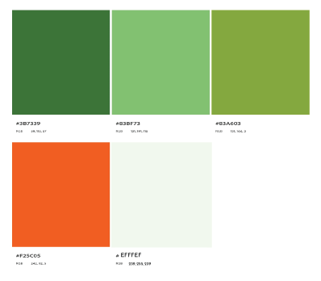

# Healthy Food Club
The Healthy Food Club is a community that hosts cooking sessions with brief health-related lectures and introduces alternative menus to promote a healthier lifestyle.
During our activities, we strive to raise awareness about the prevalence of chemicals in our lives and their impact, specially focus on the food additives, fertilizers, pesticide, and those regulations, to monitor them for a safer society and healthier life collectively.

## **[Live site](https://atsukocoffey.github.io/healthy-food-club/)**

## **[Repository](https://github.com/AtsukoCoffey/healthy-food-club)**
--------------------

## Table of contents
1.	[ UX design ](#ux)
2.	[ Existing Features ](#features)
3.	[ Features left to implement ](#featureleft)
4.	[ Technology used ](#Tech)
5.	[ Testing ](#testing)
6.	[ Bugs ](#bugs)
7.	[ Deployment ](#deployment)
8.  [ Credits ](#credits)
9.  [ Content ](#content)
10. [ Acknowledgements](#acknowledgements)

# UX design

## Strategy Plane
### Target users 
1.	Young people who are about to start living independently and their parents. 
2.	Everyone who cares about the food additives, or interested in health and love cooking. 

### User value 
1.	Users can access crucial information that could have an impact on their health and well-being.
2.	Users can learn to cook using safe and wholesome ingredients, avoiding potentially dangerous food additives.

### Difference from competitors and substitutions
1.  The Healthy Food Club is not just recipes, but has more emphasis on learning.
2.  The cooking menu for the session is aligned with the lecture content, making it more practical.

## Scope Plane 
### General user stories
*	As a user, I want to clearly understand what services are offered on this website.
*	As a user, I want to be able to easily navigate through to find contents.
*	As a user, I want the website to work on different devices and formats that I use.
*	As a user, I want a simple sign up process to select my preferred option.
*	As a user, I want to feel that healthy cooking is easy and interesting.
*	As a user, I want to see varieties of perspectives articles about health to fit my problem awareness.

### Target users and who are interested in this website
*	As a user, I want to find when is the next cooking session and what is the lecture subject clearly.
* As a user, I want to find what kind of people are organising the Healthy Food Club and are they trustworthy or not.
* As a user, I want to find out the schedules of future sessions.

### The website owner stories
*	As a site owner, I want to gather people for cooking & lecture sessions.
*	As a site owner, I want to convey clearly who we are and our purpose, to give users a sense of trust and confidence.
*	As a site owner, I want to share useful information and chemical studies.
*	As a site owner, I want to encourage people’s awareness about chemicals in our life.
*	As a site owner, I want to inform and educate about European and national regulations on food additives.
*	As a site owner, I want to provide inspiration for alternative cooking ideas.
*	As a site owner, I want to convey clearly that the Healthy Food Club is not just recipes cooking club.

## Structure Plane

* The website should have a Navigation menu that is consistent across all pages.
* The website should have a fixed footer to access anytime to see this site's SNS.  
* The website should give the user a way to contact through a form.
* The website should have breadcrumbs to let user know strong sense of place and give access to index and former pages. 
* The website should have hover interaction for links and some objects also abbreviation and tooltips with additional information to enhance user experience.
* The landing page should show what this site is offering intuitively.
* The Info page should have a variety of articles that are categorized by different perspectives.
* Burger icon is commonly used to smaller screen, so the website use this convention to represent the navigation for suit users' expectation.
* The SignUp page's submit button should be clearly visible and interact when hover it. Also changes colour and text after submit to let user knows the form was sent.

##  Skeleton Plane

### Home page mobile Wireframe

### Home page tablet and PC Wireframe

## Surface Plane

### Color
I looked around adobe color website for researching suitable color scheme. I picked fresh green and point orange color scheme and change one of the strong red color to the whitish light green.

### Typography
> Healthy Food Club Logo : "Poiret One" 
> Headings :  "Quicksand"
> basic font : "Josefin Sans"

---------------------------------------------------

# Existing Features

## Navigation Bar
Featured on all three pages, the full responsive navigation bar includes links to the Logo, Home page, Information Page and Sign Up page and is identical in each page to allow for easy navigation.
This section will allow the user to easily navigate from page to page across all devices without having to revert back to the previous page via the ‘back’ button.

## The landing page heto image
The landing includes a photograph with text overlay to convey clearly this site is about cooking and learning something.
This section introduces the user to Healthy Food Club with an eye catching animation to grab their attention

## Session schedule section.
This section Inform about the next session details with Link and some information. This section deliverately is placed just under the hero image, and try to be visible for user's first loading view angle to appeal what exactly thing the Healthy Food club is offering. 

## About us section
Introduce about us and our purpose to give user feel confidence. Also let people who live around Athlone know this type of community is occurring at Technological University of the Shannon (TUS).

## You Tube and navigate category section
This section shows a video which made by WHO, it promote the overview of healthy life styles. This will pique interest and direct user to the info page.

## The footer
The footer section includes links to the relevant social media sites. The links will open to a new tab to allow easy navigation for the user.

## info page
This page is showing all of the health information categories. There are only 4 categories at the moment, with sample pictures and explanation with some lead paragraphs.  

### Cooking basic knowledge
This category is for beginners ( young people who don’t have much cooking experiences ). Talk about tips like “Use different cutting board for meat and vegetables - preventing bacterial transmitting”…

### Healthy Gut
This category is talking about our microbes which we can't see exactly but there're a lot of studies published and spotlighting these areas.
This is a kind of general knowledge and for who interested in our body systems.

### Study of food additives and sickness
This category is Introduce some studies on how our food development activities, such as excessive refining of ingredients or breeding improvement, can actually cause illness at the genetic level. Try to find the source from Academic papers and WHO information.

### Tips and Tricks! 
This category is for who just started to have interested in, but feeling expensive or difficult. Shows first easy steps.

## The Sign Up Page
This page is showing sign up form and the session schedules also contact information ( map ).
Sign up form is interactive for user experience also submission button has some functions as mentioned above ( Structure Plane ).
This section will allow the user to get signed up to Healthy Food Club to join the sessions or the community mailing list. 
The user will be able to specify if they would like to take part in which sessions. 
The user will be asked to submit their full name and email address for required, phone number and experience inputs are optional.
Add a link under the session information section to jump to the top of the current page (form section) incase of expanding the schedule section.

## Session schedule
This section shows sample pictures with dates, lecture’s title and cooking menu. 

## Where to find us
-------------------------------

# Features left to implement

## Information Architecture (IA)
> The info page, articles will be expanding by times so those pages are creat in each category folders for organizing purpose. Or develop the system using DOM for no need HTML file anymore. 

## Online session feature
> Offline meeting can be limited number of atendees, for future growth think about the possibilities of online sessions.
------------------------------------------

# Technology used

## Html
> Used to structure my webpages

## CSS
> Used to style and add layout

## Font Awesome
> Used for all the icons in this project

## GoogleFonts
> Used for all the fonts used in this project and to compare potential fonts.

## Googlemap API
> 

# Testing
> 

# Testing Phase

**Testing for links and Form**
| Test |Outcome  |
|--|--|
|All links on Navigation lead to their correct pages| |
|Contact us button leads to contact form on contact us page| 
|Footer social links all lead to their respective social media sites ||
|Contact form submits when all criteria is filled correctly|   |
|User prevented from submitting form without correct elements| |
|Form Validation presents when incorrect input type is entered ||

**Testing for responsiveness**
| Test |Outcome  |
|--|--|
|Home page, about, po

## Google Lighthouse Testing
------------------------------------------------

# Deployment

> "Deployment" in web application development refers to the process of making a web application available for end users to access on the internet.  

1. Log in Git hub and access to purpose repository.
2. Click on 'Settings'.
3. On the left-hand sidebar, click on 'Pages'.
4. Source is 'Deploy from Branch'.
5. Select 'Main' branch.
6. Folder is 'root'.
7. Click 'Save'.
8. Click on 'Code'. After a few minutes refresh your repo.
9. On the right-hand side, in the Environments section, click on 'github-pages'.
10. Deployments page click the link to see the live site.

---------------------------------------------------------------

# Credits

Adobe color

Hero image
<a href="https://www.freepik.com/free-photo/young-smiling-woman-making-bruschetta-with-healthy-ingredients-while-preparing-food-kitchen_25777232.htm#fromView=search&page=1&position=49&uuid=0bc03e1b-f752-44c6-9880-1b484845ce49" width="500">Image by Drazen Zigic on Freepik</a>

Noodle
Photo by Jane Trang Doan: https://www.pexels.com/photo/pasta-with-vegetable-dish-on-gray-plate-beside-tomato-fruit-on-white-table-769969/

Picture pastrami beef
<a href="https://www.freepik.com/free-photo/sliced-beef-pastrami-pastrami-with-turkish-bacon-closeup-top-view-traditional-turkish-food_37833736.htm#query=pastrami&position=0&from_view=keyword&track=sph&uuid=26cf64d1-d161-45da-a382-231c4d0c2ee6" width="300">Image by ededchechine on Freepik </a>

Youtube: 
A healthy diet, a healthier world (WHO)
[https://www.youtube.com/watch?v=XMcab1MFaLc](https://www.youtube.com/watch?v=XMcab1MFaLc)

[https://www.youtube.com/watch?v=JU51f737Obg](https://www.youtube.com/watch?v=JU51f737Obg)

people-group
<code>
<i class="fa-solid fa-people-group"></i>
Facebook
<i class="fa-brands fa-square-facebook"></i>
x-twitter
<i class="fa-brands fa-square-x-twitter"></i>
Youtube
<i class="fa-brands fa-youtube"></i>
Instagram
<i class="fa-brands fa-instagram"></i>

Circle info
<i class="fa-solid fa-circle-info"></i>
</code>

Map of TUS
[https://maps.app.goo.gl/yFF4T7ChemuH2YJt5](https://maps.app.goo.gl/yFF4T7ChemuH2YJt5)

Welcome,

This is the Code Institute student template for Codeanywhere. If you are using Gitpod then you need [this template](https://github.com/Code-Institute-Org/gitpod-full-template) instead.  We have preinstalled all of the tools you need to get started. It's perfectly ok to use this template as the basis for your project submissions.

You can safely delete this README.md file, or change it for your own project. Please do read it at least once, though! It contains some important information about Codeanywhere and the extensions we use. Some of this information has been updated since the video content was created. The last update to this file was: **August 30th, 2023**

## Codeanywhere Reminders

To run a frontend (HTML, CSS, Javascript only) application in Codeanywhere, in the terminal, type:

`python3 -m http.server`

A button should appear to click: _Open Preview_ or _Open Browser_.

To run a frontend (HTML, CSS, Javascript only) application in Codeanywhere with no-cache, you can use this alias for `python3 -m http.server`.

`http_server`

To run a backend Python file, type `python3 app.py`, if your Python file is named `app.py` of course.

A button should appear to click: _Open Preview_ or _Open Browser_.

In Codeanywhere you have superuser security privileges by default. Therefore you do not need to use the `sudo` (superuser do) command in the bash terminal in any of the lessons.

To log into the Heroku toolbelt CLI:

1. Log in to your Heroku account and go to _Account Settings_ in the menu under your avatar.
2. Scroll down to the _API Key_ and click _Reveal_
3. Copy the key
4. In Codeanywhere, from the terminal, run `heroku_config`
5. Paste in your API key when asked

You can now use the `heroku` CLI program - try running `heroku apps` to confirm it works. This API key is unique and private to you so do not share it. If you accidentally make it public then you can create a new one with _Regenerate API Key_.

---

Happy coding!
