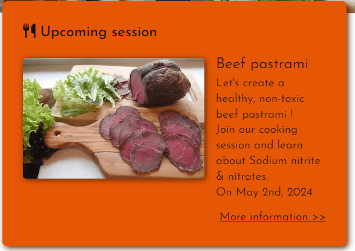
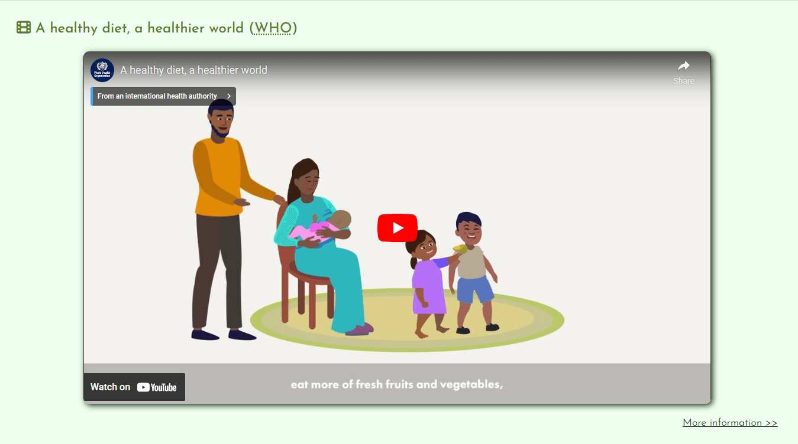
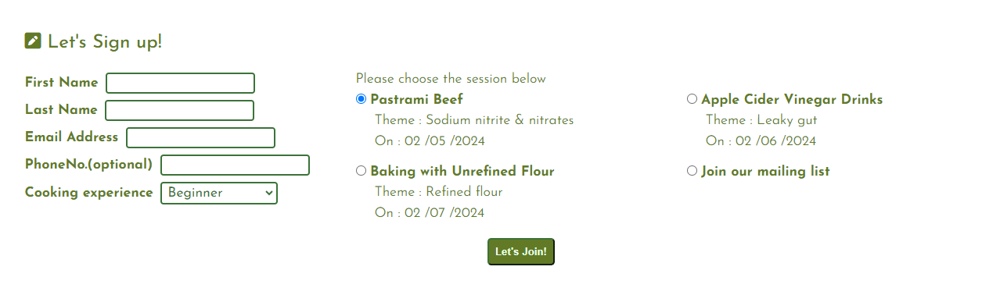
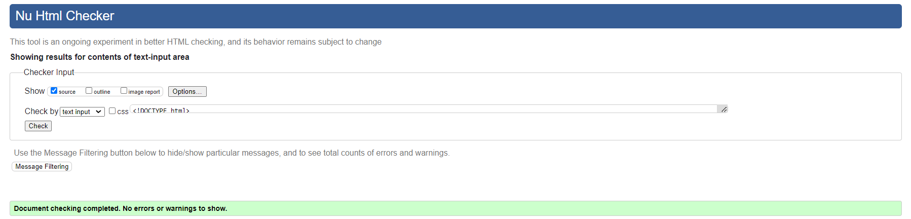
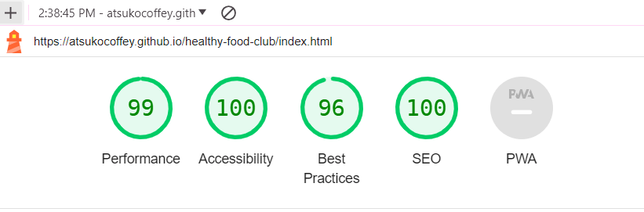
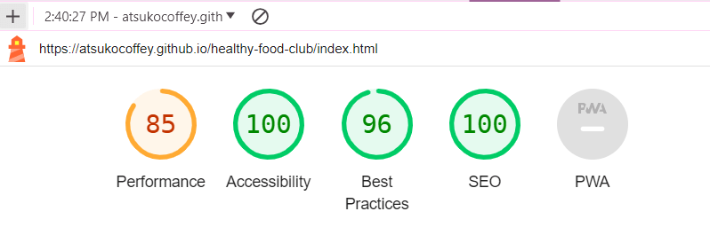

# Healthy Food Club
The "Healthy Food Club" is a community that hosts cooking sessions with brief health-related lectures and introduces alternative menus to promote a healthier lifestyle.  
  
During our activities, we strive to raise awareness about the prevalence of chemicals in our lives and their impact; with special focus on food additives, fertilizers, pesticide, and those regulations, to monitor them for a safer society and healthier life collectively.

## Live site

**[Live site >> https://atsukocoffey.github.io/healthy-food-club/](https://atsukocoffey.github.io/healthy-food-club/)**

## Table Of Contents
1.	[ UX DESIGN ](#ux)
2.	[ EXISTING FEATURES ](#features)
3.	[ FUTURE FEATURES ](#futurefeature)
4.	[ TECHNOLOGY USED ](#tech)
5.	[ TESTING ](#testing)
6.	[ BUGS ](#bugs)
7.	[ DEPLOYMENT ](#deployment)
8.  [ CREDITS - Code references](#credits)
9.  [ CREDITS - Content References](#credits-content)
10. [ CREDITS - Imagery](#imagery)
11. [ CREDITS - Editing And Proofreading](#credits-edit)
12. [ ACKNOWLEDGEMENTS](#acknowledgements)

# UX DESIGN

## 1. Strategy Plane
### Target users 
1.	Young people who are about to start living independently, as well as their parents.
2.	Everyone who cares about food additives, health and simply enjoys cooking.

### User value 
1.	Users can access and learn crucial information that could have an impact on their health and well-being.
2.	Users can find a community which promotes everyone’s health through lectures and cooking lessons.
3.	Users can learn alternative cooking knowledge to avoid potentially dangerous food additives and unnaturally excessively processed food.

### Difference from competitors and substitutions
1.  The "Healthy Food Club" is not just recipes, but has more emphasis on learning.
2.  The cooking menu for the session is aligned with the lecture content, making it more practical.

## 2. Scope Plane 
### First time visitor
*	As a user, I want to clearly understand what services are offered on this website.
*	As a user, I want to be able to easily navigate through to find contents.
*	As a user, I want the website to work on different devices and formats that I use.
*	As a user, I want a simple sign-up process allowing me to select my preferred option.
*	As a user, I want to feel that healthy cooking is interesting and not difficult.
*	As a user, I want to see articles that offer a variety of perspectives on health to increase my awareness and knowledge.

### Returning and frequent visitor
*	As a user, I want to find out when the next cooking session is and clearly identify what the lecture subject will be.
* As a user, I want to find out what kind of people are organising the "Healthy Food Club" and whether they are trustworthy or not.
* As a user, I want to find out the schedules of future sessions.

### The website owner stories
*	As a site owner, I want to gather people for cooking & lecture sessions.
*	As a site owner, I want to convey clearly who we are and our purpose, to give users a sense of trust and confidence.
*	As a site owner, I want to share useful information and food science studies.
*	As a site owner, I want to encourage people’s awareness about chemicals in our life.
*	As a site owner, I want to inform and educate about European and national regulations on food additives.
*	As a site owner, I want to provide inspiration for alternative cooking ideas.
*	As a site owner, I want to convey clearly that the "Healthy Food Club" is not just about recipes and cooking.

## 3. Structure Plane

* The website should have a Navigation menu that is consistent across all pages.
* The website should have a fixed footer to access anytime to see this site's SNS.  
* The website should give the user a way to contact through a form.
* The website should have breadcrumbs to help users feel a strong sense of place and also give access to previous pages when it expands to become a larger website.
*	The website should have hover interaction for links, abbreviation, and tooltips with additional information to enhance user experience.
* The landing page should show what this site is offering intuitively.
* The Info page should have a variety of articles that are categorized by different perspectives.
* Burger icon is commonly used on smaller screens, so using this convention suits users' expectations.
*	The Sign-up page submit button should be clearly visible and interactive when the mouse hovers over it. 

## 4. Skeleton Plane

### Wireframes

For the mobile screen wireframe, I simply lined up important and necessary information under the flow of UX design strategy as I thought there wasn't much excess spaces.  

Mobile - 320px - Wireframe

  

I planned consciously to create contrast in sizes, information, and images for the tablet screen wireframe.  
Also I placed paragraphs diagonally on the layout of the useful information page to use the space more playfully.  

For PC monitor wireframe, I wanted to fit the contents for any width using flex box for the large monitor size layout.   

Tablet - 768px - and PC - 1440px - Wireframes

  

## 5. Surface Plane

### Colour
At the planning stage, I chose this colour scheme, which has a healthy, lively, clear and optimistic feeling, from the Adobe colour website. [CREDITS Content References - Adobe Color API](#credits-content) 
  

However, using only these colors couldn’t provide enough contrast, so I adjusted the color scheme as below.  
  

### Typography

I selected "Poiret One" for the “Healthy Food Club” Logo from Google font API. It is attractive and has sharp features and it’s not too heavy.  
For the site's basic font, I was considering using "Quicksand" for the best readability, however our target users are young people and since it’s not a huge business website so a little bit unique font like "Josefin Sans" might appeal well to this unique community. [TECHNOLOGY USED - Google Fonts](#tech)  

* "Poiret One"  
  

* "Josefin Sans"  

# EXISTING FEATURES

## The Header And Navigation Bar
The header, with the logo, is the face of the website. So I chose the strongest colour in my colour scheme for appeal, along with unique logo. This header includes the navigation bar which is fully responsive to all sizes of devices and it swaps to the toggle button to hide and show navigation links for smaller screen sizes, less than 768px width. I borrowed this toggle button technique from “Love Running” project in Code Institute LMS. [CREDITS - Code Institute learning material](#credits-content)  
The navigation bar has links to the logo, home page, information page and sign-up page and also has an easy to recognise icons.  
This feature is on all three pages and is identical in each page to allow for easy navigation.  

## The Landing Page Hero Image
The landing hero image is really important as it should convey clearly the website purpose and show the atmosphere of this community, I am happy that I could find a picture of a smiling girl preparing food in the kitchen. The overlay text also conveys logically what this site is about, my main message was basically like this “let’s study together for a healthier life together”. Since I am not native Irish I asked my family for help with more natural phrasing. [CREDITS - Editing and Proofreading](#credits-edit)
This section introduces the user to “Healthy Food Club” with an eye-catching css animation which technique is borrowed from again “Love Running” (Deprecated version) project in Code Institute. [CREDITS - Hero Image CSS animation  Code Institute learning Material](#credits-heroanime) Afterwards, I found a critical mistake in this. [BUGS - Hero Image CSS Animation](#bugs-heroanime)  

## Upcoming Session Info Section
This section Informs about the next cooking session with a link to the session schedule page.  
This section is deliberately placed just under the hero image with outstanding background colour to be visible in the first loading view angle. The reason is that this info shows clearly what activities exactly the “Healthy Food club” is offering in this website.  

About this coding part, I consider using the `<figure>` element for an image since it is a part of the other page's content also it contains independent information. At same time, I wanted to use the `<picture>` element for responsivity though I wasn't familier with these codes so referenced other websites. [CREDITS - stackoverflow, perplexity](#credits-figure)  

## About Us Section
Introduction about us and our purpose to give user feel confidence. Also if users live around Athlone town, we’d like to let them know this community session is being held at Technological University of the Shannon (TUS) where anyone can come.  

This TUS map is not a necessary item where the screen space is valuable in small screens. So it will not be visible on screens less than 320px.  

## Article YouTube Section
This section shows a health related video made by WHO; it promotes the overview of healthy life styles. I am aiming for this to pique user’s interest and redirect them to the information page.  

I used iframe for this YouTube video and I had some problems to display it properly. [BUGS - Setting Height Automatically, YouTube-iframe](#bugs-youtube) Also [BUGS - Align Center, YouTube-iframe](#bugs-youtube)  

Additionally in the auditing term, Google Lighthouse audit scored this page really low because of the iframe using the unnecessary Java Script. [YouTube Video Optimizing For Google Lighthouse audit](#bugs-heroanime)   

## The Footer
The footer section includes links to the relevant social media sites. The links will open to a new tab to keep this website still. When this community's activity gets busier this footer allow users easy navigation for anytime they can check recent updates.  

## Breadcrumb
This feature lets users know which page they are on, giving a strong sense of place. It will be important if the site becomes larger.  

Since HTML5 added new usefull elements, so I searched what's the suitable element for this. [Breadcrumb, what element and attributes - W3school](#credits-heroanime)    

## Information Page

This page is for the varieties of health information, they are categorised and present some leading text that explains what kind of information in here. There are only 4 categories at the moment with sample pictures, however this page will be expand over the time with more information.  

* Cooking basic knowledge  
This category is for beginners, I'm thinking about young people who don’t have much cooking experiences.  

* Healthy gut  
This category is talking about our microbes which we can't see exactly but there're a lot of studies published and spotlighting these areas.  
This is a kind of general knowledge for who's interested in our body systems.  

* Studies on food additives and sickness  
This category Introduces some studies on how our food-related activities, such as excessive refining of ingredients or breeding improvement, can actually cause illness at the genetic level.  
I'd like to find the sources from Academic papers and public trusted information.  

* Tips and tricks!  
This category is for those who have just become interested in food. To encourage them without making it feel costly or difficult, this topic shows the first easy steps to start.  

## The Sign-up Form
The sign-up form is interactive for user experience with mouse hovering colour, also the submission button has the same function with changing background colour. This section will allow users to get signed up along with specifying which session they would like to take part in or join the community mailing list. The user will be asked to submit their full name and email address for required information, phone number and cooking experience inputs are optional information.  
My mentor Alan taught me `pattern` attribute for these form inputs. This can prevent incorrect user inputs to submit. [CREDITS - Pattern attribute](#credit-form) Also Autocomplete was suggested by Google Lighthouse audit. [CREDITS - Form Autocomplete](#credit-form)  

| Form input | Criteria |
| -- | -- |
| First name| Texts only |
| Last name | Texts only |
| Phone number | Numbers only |
| Email address | "@" mark necessary |  

## Session Schedule
This feature informs future session dates, lecture titles and cooking menus that are aligned with the lecture content.  

In my wireframe, I was thinking the sesseion schedule layout would be the same as the info page content's layout because both are list items. But the session schedule won't be a long list, so kept diagonally layout for larger screen size for more atractive looking.  

## Where To Find us
This feature shows contact information and map of the venue.  
Added a link under the contact information section, I want to lead users back into the form section again.  

I had a problem with Google Maps, Google Lighthouse audit pointed out third party cookies in this map. [BUGS - Remove Third-party Cookies, Google Maps](#bugs-map)   

# FUTURE FEATURES

## The article pages of the information page  
The information page has four categories and those article pages have not been built yet. Therefore the next feature that should be done must be to finish those article pages.  

## Information Architecture (IA)
In the info page, categories and articles will be expanding over time, so new pages will be created in each category folder for organisational purposes. Or if possible, develop the system using a technology like DOM to generate HTML pages by coding.   

## Online Session Feature
For future growth, an online session feature might be a good idea for meeting people who live far away from Athlone town. Also it might be better for new users who want to listen to lectures only or just learn the cooking part to feel free to join in.  

------------------------------------------

# TECHNOLOGY USED

* HTML
> Used to structure my webpages  

* CSS
> Used to style and add layout  

* GitHub 
> Used for our project's platform 

* GitPod 
> Used as my  Integrated Development Environment (IDE) system

* Font Awesome
> Used for all the icons in this project  

* Google Fonts
> Used for all the fonts used in this project and to compare potential fonts.  

* Google Maps - MAPS.IE 
> Used for the map of the venue in "Where to find us" section

* tinify - Smart WebP, PNG and JPEG Compression for Faster Websites
> Used for compress all the image files

* FreeConvert - WebP Converter
> Used for generating webp format

* Am I Responsive? 
> Used for creating responsivity example image

* favicon.cc
> Used for creating an original favicon icon

* Adobe Illustrator
> Used for creating wireframes

* Adobe Photoshop
> Used for editing pictures

# TESTING

**Testing for links and Form**
| Test |Outcome  |
|--|--|
|All links on Navigation lead to their correct pages| Pass |
|More information >> leads to the each target pages| Pass |
|Footer social links all lead to their respective social media sites | Pass |
|Contact form submits when all criteria is filled correctly| Pass |
|User prevented from submitting form without correct elements| Pass |
|Form Validation presents when incorrect input type is entered | Pass |

**Testing for responsiveness**
| OS | Browser | Test | Outcome |
|--|--|--|--|
| Windows | Chrome | All three pages display correctly on screens larger than 1024px | Pass |
|  |  | All three pages display correctly on screens larger than 768px | Pass |
|  |  | All three pages display correctly on screens larger than 320px | Pass |
|  |  | All three pages display correctly on screens smaller than 320px | Pass |
|  | Edge | All three pages display correctly on screens larger than 1024px | Pass |
|  |  | All three pages display correctly on screens larger than 768px | Pass |
|  |  | All three pages display correctly on screens smaller than 768px | Pass |
|  | Firefox | All three pages display correctly on screens larger than 1024px | Pass |
|  |  | All three pages display correctly on screens larger than 768px | Pass |
|  |  | All three pages display correctly on screens smaller than 768px | Pass |
| Mac | Chrome | All three pages display correctly on screens larger than 1024px | Pass |
|  |  | All three pages display correctly on screens larger than 768px | Pass |
|  |  | All three pages display correctly on screens smaller than 768px | Pass |
|  | Safari v13 | All three pages display correctly on screens larger than 1024px | Fail |
|  |  | All three pages display correctly on screens larger than 768px | Fail |
|  |  | All three pages display correctly on screens smaller than 768px | Fail |
|  | Firefox | All three pages display correctly on screens larger than 1024px | Pass |
|  |  | All three pages display correctly on screens larger than 768px | Pass |
|  |  | All three pages display correctly on screens smaller than 768px | Pass |
| iPad 8th generation| Chrome | All three pages display correctly on screens logical 810px
Physical 1620px | Pass |
|  | Safari v14 | All three pages display correctly on screens logical 810px
Physical 1620px | Pass |
| Android Xperia | Chrome | All three pages display correctly | Pass |
|  | Edge | All three pages display correctly | Pass |

I found the Mac OS Safari v13 browser is not supporting webp image format.
I talked with my cover mentor, Chris, about this, and then I decided not to address this issue.
Additionally, my iPad Safari v14 has no problem browsing, which was released nearly 4 years ago. 

## W3 Validator

* Top page - index.html  
  

* Information page - info.html  
  

* Sign-up page - signup.html  
  

## W3 CSS Validator

* Style sheet - style.css
  

## Google Lighthouse Audit

* Top page - index.html  

Google Lighthouse audit index.html - Device Desktop >> 
  

  

  

Google Lighthouse audit index.html - Device Mobile >> 
  

  

  

* Information page - info.html  

Google Lighthouse audit info.html - Device Desktop >> 
  

  

  

Google Lighthouse audit info.html - Device Mobile >> 
  

  

   

* Sign-up page - signup.html  

Google Lighthouse audit signup.html - Device Desktop >> 
  

  

  

Google Lighthouse audit signup.html - Device Mobile >> 
  

  

   

# BUGS

## Header

My header nav toggle button was missing in the small screen size view. Then I found it was caused by unexpected spaces around the title and the toggle button. It took a long time to find out what was happening though it was a good lesson to use the Google dev tool to inspect the CSS. I found my mistake with `Flex justify-content` was `space-around`, I meant to set `space-between`. 
  
Solution : Fix CSS `Flex justify-content` `space-around` to `space-between`

## YouTube-iframe Setting Height Automatically

I struggled with figuring out how to set the video height automatically to fit the screen size. After I tried and failed, I found a good technique that involves using padding-bottom with the ratio of the video width at stackoverflow.   

Solution : Set parent `
 padding-bottom ` the YouTube video size ratio 56.25% (16:9)

YouTube iframe height technique - stackoverflow >> 
  

  

## YouTube-iframe Align Center

I struggled again to set this `<iframe>` `align:center`, without using `text-align` of `flex` to the parent `<article>` element or outer `
` element’s properties setting. This simple and fantastic technique persuaded me very well.  

Solution : Add `display: block` to the  `<iframe>`

YouTube iframe align center technique - stackoverflow >> 
  

  

## Hero Image CSS Animation Scale 1 to 1.1 

I realised that this CSS animation caused excess space around the page as the hero image was literally enlarged by CSS.  
I was too excited to use this technipue to check carefully the parents `
` setting.  

Solution : `overflow: hidden` for outside `
`  

Hero image CSS animation scale 1 to 1.1 - "Love Running" walkthrough project (deprecated) >> 
  

  

## YouTube Video Optimizing For Google Lighthouse audit
Google Lighthouse audit told me that the YouTube Java Script is unnecessary and it’s better to remove it for faster loading. I searched about it and doubt if it’s true, I think it’s necessary when users start a video.  
Alternatively we can stop reading Java Script when the page is loading, using the `source=doc` attribute.  

Solution : Put the HTML link element inside the `source=doc` attribute 

YouTube video optimizing for lighthouse - stackoverflow >> 
  

   
   

After the endpoint cover-meeting with Chris, I thought I didn't need to address the point that the Lighthouse pointed out. Chris's advice was that I don't have to worry about the score so much and should avoid to have inline CSS in the HTML. So I decided to go back to the original code.

## Google Maps – Remove Third-party Cookies

At the beginning I had five third-party cookies related to Google Maps. This caused Google Lighthouse audit's SEO score to be low - around 70. After looking for the solution, I found this “ Prepare for third-party cookie restrictions “ article. Acording to this, all Chrome user third-party cookies phase out from next year. I might have to use Google Maps API for cookie-free map, but I had to register my credit card which I wasn’t willing to do. Therefore I gave up this time and had just tried to set my browser’s cookie blocked, and get the map URL from other map website. ( I got from MAPS.IE - My mentor showed me this website in my second project meeting - ) In this way I can audit with no third party cookie problem. However this cookie warning appeared again after my browser’s third-party cookies turned on.  

* [Link - Google Maps remove third-party cookies](https://developers.google.com/privacy-sandbox/3pcd?utm_source=lighthouse&utm_medium=devtools "Google Maps – remove third-party cookies")  
* [Link - MAPS.IE](https://www.maps.ie/ "MAPS.IE")

## Display Error in iPad screen

In the testing phase of the Useful information page, I found a display error in my iPad; both Google Chrome and Safari browsers had the same issue. So I changed the part that was using margin for the layout to use position to ensure that this page renders correctly. 

Display Error in iPad screen - Before >> 
  

  

Display Error in iPad screen - After >> 
  

   

# DEPLOYMENT

> "Deployment" in web application development refers to the process of making a web application available for end users to access on the internet.  

Git hub - log in >> 
  

  

1. Log in Git hub and access to purpose repository.

In the purpose repository click on.. >> 
  

, side navigation bar (3)")

2. Click on 'Settings' in the top navigaton bar.
3. On the left-hand sidebar, Click on 'Pages'.

In the GitHub Pages, Build and deployment >> 
  

, 'Main' branch (5), 'root'(6),  'save'(7)")

4. Source is 'Deploy from Branch'.
5. Select 'Main' branch.
6. Folder is 'root'.
7. Click 'Save'.

Back to top navigaton bar, left hand side.. >> 
  

")

8. Click on 'Code'. After a few minutes refresh your repo.

Right hand side, aside section.. >> 
  

")

9. On the right-hand side, in the Environments section, click on 'github-pages'.

10. Deployments page click the link to see the live site.

# CREDITS

## Code References

### CSS `[attribute="value"]` Selector

I learned this selector at “Love Running” walk through project, using this for button’s functions. For making it my tool, I checked at W3schools website for further more information.
* [Link to W3school website - CSS Attribute Selectors](https://www.w3schools.com/css/css_attribute_selectors.asp "CSS Attribute Selectors")

### Meta Element `<meta http-equiv="X-UA-Compatible" content="IE=edge">`

I researched what is this meta tag for, I guess we might not need this tag anymore though, just in case for the people who are still using old version of IE, it might be better to help them.   

Meta Element X-UA-Compatible - stackoverflow, perplexity

### Figure And Picture Element 

In the upcoming session section, I consider using the `<figure>` element for an image and the `<picture>` element for UI responsivity. But I wasn’t familiar with both elements to use so I looked for some hints. I couldn’t find out how to use both in the W3 school or MDN though there were some coversations at stackoverflow and I also asked perplexity whether I could include picture element in the figure element. It doesn't seem to be a problem to include it. 

Figure And Picture Element - stuckoverflow, perplexity

### Hero Image CSS Animation Scale 1 to 1.1 
When I learned this css animation technique through the “Love Running” project in Code Institute, I was amazed to discover that I could create animation without Java Script, which was common 20 years ago. 

Hero Image CSS Animation - “Love Running” project in Code Institute

### Breadcrumb
I looked for suitable elements for the breadcrumb links. In W3 website the answer was `<nav>` and using aria attribute for describing the location. Moreover I got an opportunity to learn about `::before` pseudo-element in relation to this.  

Breadcrumb, what element and attributes - W3school

  

Breadcrumb, specify which list item - stackoverflow

  

Breadcrumb, "/" between list item - MDN

   

Breadcrumb, `::before` selector - W3 school

  

* [Link to "::before / ::after" - CSS TRICKS ](https://css-tricks.com/almanac/selectors/a/after-and-before/)

 

### Form  Autocomplete Attribute
Google Lighthouse audit suggested me to use autocomplete attribute for form, and I found this is really helpful for user.  

* [Link to MDN website - Form autocomplete attribute](https://developer.mozilla.org/en-US/docs/Web/HTML/Attributes/autocomplete "Form autocomplete attributer")

### Form Input Pattern Attribute
My mentor Alan taught me about this `<input>` pattern attribute for preventing invalid form data submission.
EG. for alphabet only and 3 letters `pattern="[A-Za-z]{3}"`  

* [Link to W3schools website - Form input pattern attribute](https://www.w3schools.com/tags/att_input_pattern.asp#:~:text=The%20pattern%20attribute%20specifies%20a,pattern%20to%20help%20the%20user "Form input pattern attribute")

### Hero Image Optimizing For LCP
The hero image is not a small size image. After I read this article, I tried to optimize the reading time of the hero image using `<link rel="preload">’ for increasing LCP score.  

* [Link to web.dev - Optimize Largest Contentful Paint](https://web.dev/articles/optimize-lcp?utm_source=lighthouse&utm_medium=lr#optimize_when_the_resource_is_discovered "Optimize Largest Contentful Paint")

### Clearfix using ::after pseudo selector
I was thinking where to set clearfix for the session schedule's float in the signup page. Also after I learned `::before` pseudo selector, I'd like to try to use `::after` selector. Then I found this page. 

* [Clearing and Containing Floats - Responsive Web Design](http://web.simmons.edu/~grovesd/comm328/modules/layout/clearfix#:~:text=Clearing%20Floats,the%20sidebar%20and%20main%20content "Clearing and Containing Floats - Responsive Web Design")

## Content References

### Code Institute Learning Material
* [Link to Code Institute Full-Stack Software Development Program](https://codeinstitute.net/?nab=0 "Code Institute Full-Stack Software Development Program")

### Adobe color API  
* [Link to Adobe Color EXPLORE 'food' keyword ](https://color.adobe.com/search?q=food "Adobe Color EXPLORE 'food' keyword")

### YouTube: 
A healthy diet, a healthier world (WHO)  
* [Link to A healthy diet, a healthier world (WHO) ](https://www.youtube.com/watch?v=XMcab1MFaLc "A healthy diet, a healthier world (WHO) ")

### Google Maps of TUS from MAPS.IE
* [Link to https://www.maps.ie/](https://www.maps.ie/)

### W3schools
> Used to research codes

### MDN
> Used to research codes

### stackoverflow
> Used to research codes

### CSS TRICKS
> Used to research codes

### web.dev
> Used to research code and knowledge

### Responsive Web Design
> Used to research codes

### perplexity
> Used for general questions

## Imagery

* Hero image  
<a href="https://www.freepik.com/free-photo/young-smiling-woman-making-bruschetta-with-healthy-ingredients-while-preparing-food-kitchen_25777232.htm#fromView=search&page=1&position=49&uuid=0bc03e1b-f752-44c6-9880-1b484845ce49" width="500">Image by Drazen Zigic on Freepik</a>

* Picture pastrami beef  
<a href="https://www.freepik.com/free-photo/sliced-beef-pastrami-pastrami-with-turkish-bacon-closeup-top-view-traditional-turkish-food_37833736.htm#query=pastrami&position=0&from_view=keyword&track=sph&uuid=26cf64d1-d161-45da-a382-231c4d0c2ee6" width="300">Image by ededchechine on Freepik </a>

* A cutting board and a knife
Image by <a href="https://pixabay.com/users/rambling_roy-29593818/?utm_source=link-attribution&utm_medium=referral&utm_campaign=image&utm_content=7471627">Roy Stephen</a> from <a href="https://pixabay.com//?utm_source=link-attribution&utm_medium=referral&utm_campaign=image&utm_content=7471627">Pixabay</a>

* Wash vegetable
Image by <a href="https://pixabay.com/users/myccf-20343736/?utm_source=link-attribution&utm_medium=referral&utm_campaign=image&utm_content=6064523">MYCCF</a> from <a href="https://pixabay.com//?utm_source=link-attribution&utm_medium=referral&utm_campaign=image&utm_content=6064523">Pixabay</a>

* Healthy gut
<a href="https://www.freepik.com/free-photo/close-up-young-womans-hands-slim-belly_1147751.htm#fromView=search&page=1&position=4&uuid=1ebdfc47-60a3-4a3a-b410-88118cc29503">Image by katemangostar on Freepik</a>

* Stethoscope and prescription on 
<a href="https://www.freepik.com/free-photo/stethoscope-prescription-laptop_1129630.htm#fromView=search&page=1&position=1&uuid=f4a7e8ec-52a1-4d5a-a01a-0b7970a5e091">Image by jannoon028 on Freepik</a>

* Apple vinegar
Photo by Tijana Drndarski: [https://www.pexels.com/photo/photo-of-slice-green-apple-and-cinnamon-stick-3338676/](https://www.pexels.com/photo/photo-of-slice-green-apple-and-cinnamon-stick-3338676/)

* Baking
Photo by Gil Goldman: [https://www.pexels.com/photo/fresh-bread-loafs-on-table-in-bakery-4268507/](https://www.pexels.com/photo/fresh-bread-loafs-on-table-in-bakery-4268507/)

* vegetables  
<a href="https://www.freepik.com/free-ai-image/world-health-day-celebration-with-healthy-food_138542824.htm#query=healthy%20food&position=7&from_view=keyword&track=ais&uuid=ab2f5d84-4557-4db6-a6b3-9449a4cfd196">Image by freepik</a>

* Map of Technological University of the Shannon (TUS) campus
<a href="https://tus.ie/estates/athlone/campus-maps/">Athlone Campus Map - Technological University of the Shannon</a>

## Editing and Proofreading
Since I am not a native English speaker, my family assisted me with editing and proofreading.
 [ACKNOWLEDGEMENTS](#acknowledgements)  

# ACKNOWLEDGEMENTS  

I would like to give great thanks to my mentor Alan Bushell and cover session's mentor Chris Quinn for their exellent advice and support.  
Also my cohort facilitator Amy Richardson for all the support and assistance.  

And great thanks to my family Sean Coffey and Dean Coffey for all the support.
