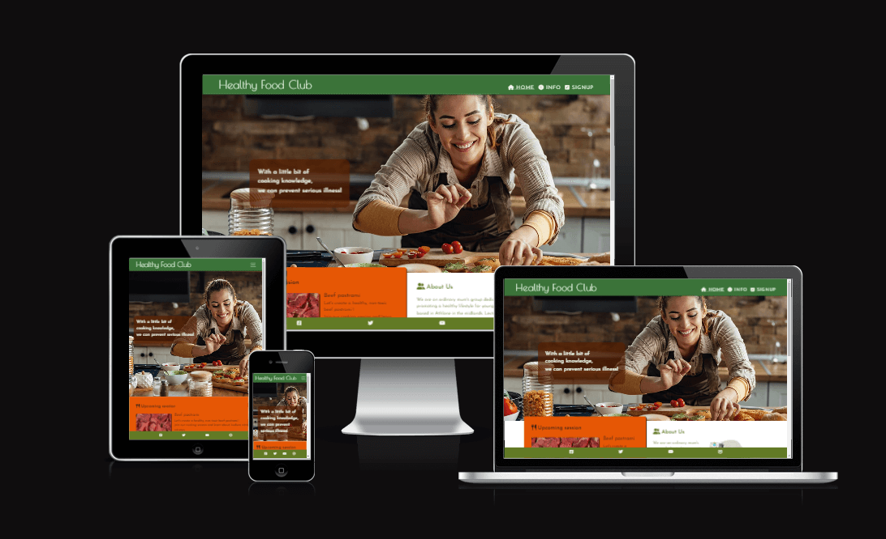
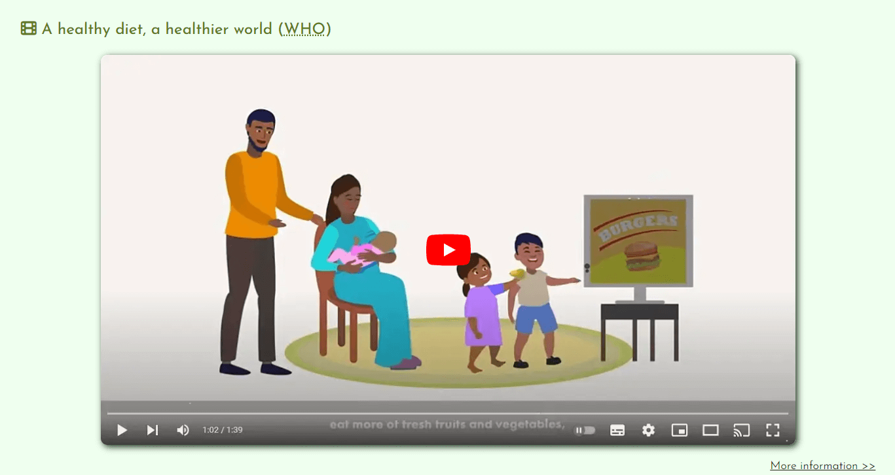
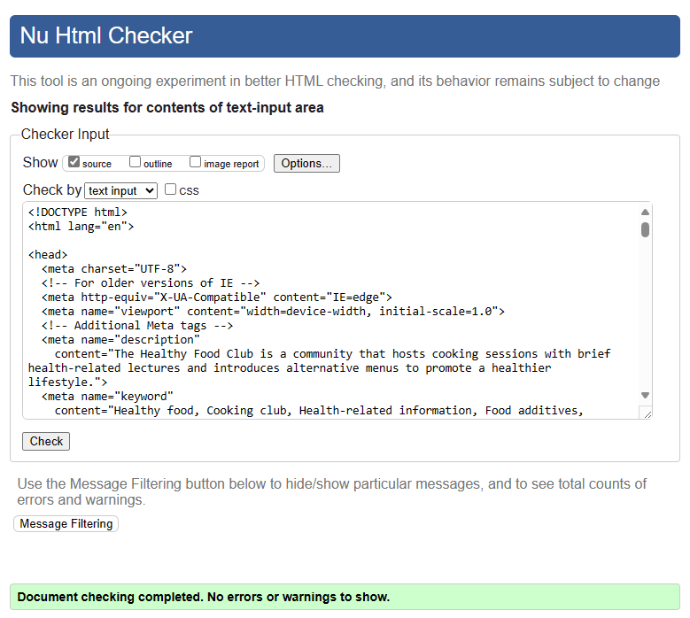
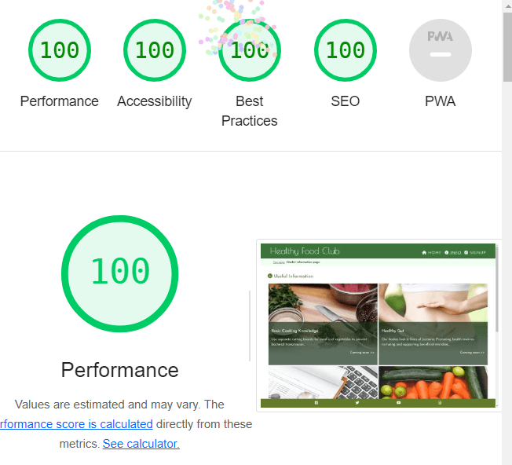

# Healthy Food Club
The Healthy Food Club is a community that hosts cooking sessions with brief health-related lectures and introduces alternative menus to promote a healthier lifestyle.  
  
During our activities, we strive to raise awareness about the prevalence of chemicals in our lives and their impact, specially focus on the food additives, fertilizers, pesticide, and those regulations, to monitor them for a safer society and healthier life collectively.

## **[Live site](https://atsukocoffey.github.io/healthy-food-club/)**

## Table of contents
1.	[ UX design ](#ux)
2.	[ Existing Features ](#features)
3.	[ Features left to implement ](#featureleft)
4.	[ Technology used ](#Tech)
5.	[ Testing ](#testing)
6.	[ Bugs ](#bugs)
7.	[ Deployment ](#deployment)
8.  [ Credits ](#credits)
9.  [ Content ](#content)
10. [ Acknowledgements](#acknowledgements)

# UX design

## 1. Strategy Plane
### Target users 
1.	Young people who are about to start living independently, as well as their parents
2.	Everyone who cares about food additives, health and simply enjoys cooking.

### User value 
1.	Users can access and learn crucial information that could have an impact on their health and well-being.
2.	Users can find the community which is promoting everyone’s health through lectures and cooking lessons.
3.	Users can learn alternative cooking knowledge to avoid potentially dangerous food additives and unnaturally excessive processed food.

### Difference from competitors and substitutions
1.  The Healthy Food Club is not just recipes, but has more emphasis on learning.
2.  The cooking menu for the session is aligned with the lecture content, making it more practical.

## 2. Scope Plane 
### General user stories
*	As a user, I want to clearly understand what services are offered on this website.
*	As a user, I want to be able to easily navigate through to find contents.
*	As a user, I want the website to work on different devices and formats that I use.
*	As a user, I want a simple sign-up process with selecting my preferred option.
*	As a user, I want to feel that healthy cooking is interesting and not difficult.
*	As a user, I want to see articles that offer a variety of perspectives on health to fit my problem awareness.

### Target users and who are interested in this website
*	As a user, I want to find out when the next cooking session is and what the lecture subject will be clearly..
* As a user, I want to find what kind of people are organising the Healthy Food Club and are they trustworthy or not.
* As a user, I want to find out the schedules of future sessions.

### The website owner stories
*	As a site owner, I want to gather people for cooking & lecture sessions.
*	As a site owner, I want to convey clearly who we are and our purpose, to give users a sense of trust and confidence.
*	As a site owner, I want to share useful information and chemical studies.
*	As a site owner, I want to encourage people’s awareness about chemicals in our life.
*	As a site owner, I want to inform and educate about European and national regulations on food additives.
*	As a site owner, I want to provide inspiration for alternative cooking ideas.
*	As a site owner, I want to convey clearly that the Healthy Food Club is not just recipes cooking club.

## 3. Structure Plane

* The website should have a Navigation menu that is consistent across all pages.
* The website should have a fixed footer to access anytime to see this site's SNS.  
* The website should give the user a way to contact through a form.
* The website should have breadcrumbs to help users feel a strong sense of place and also give access to former pages when it expands to become a larger website.
*	The website should have hover interaction for links, abbreviation, and tooltips with additional information to enhance user experience.
* The landing page should show what this site is offering intuitively.
* The Info page should have a variety of articles that are categorized by different perspectives.
* Burger icon is commonly used to smaller screen, so using this convention to represent the navigation suits users' expectations.
*	The Sign-up page submit button should be clearly visible and interactive when mouse hover it. It should also change colour and text after submitting to indicate that the form was sent.

## 4. Skeleton Plane

### Wireframes

Home page mobile Wireframe

Home page tablet and PC Wireframes

## 5. Surface Plane

### Color
At the planning stage, I chose this colour scheme, which has a healthy, lively, clear and optimistic feeling, from the Adobe colour website.  
  

However, using only these colors couldn’t provide enough contrast, so I adjusted the color scheme as below.  
  

### Typography

I selected "Poiret One" for the “Healthy Food Club” Logo from Google font API. It is attractive and has sharp features and it’s not too heavy.  
I was considering using "Quicksand" for the best readability, however our target users are young people and since it’s not a huge business website so a little bit unique font like "Josefin Sans" might appeal well to this unique community. 
* "Poiret One"
* "Josefin Sans"

### Imagery

# Existing Features

## Header and Navigation Bar

The header, with the logo, is the face of the website. So I chose the strongest colour in my colour scheme to appeal, along with unique logo. This header includes the navigation bar which is full responsive to all size of devices and it swaps to the toggle button to hide and show the navigation links for small screen sizes, less than 768px width. I borrowed this toggle button technic from “Love Running” project in Code Institute LMS. ( Credit section )  
The navigation bar has links to the logo, home page, information page and sign-up page and also has an easy to recognize icons.  
This feature is on all three pages and is identical in each page to allow for easy navigation.

## The landing page hero image

The landing hero image is really important as it should convey clearly the website purpose and show the atmosphere of this community, I am happy that I could find out a picture that a smiling girl preparing food in the kitchen.  
The overlay text also conveys logically what this site is about, my main message was basically like this “let’s study together for a healthier life together”. Since I am not native Irish so I asked my family for help to consider making it more natural phrase. ( Credit section )  
This section introduces the user to “Healthy Food Club” with an eye catching css animation which technique is borrowed from again “Love Running” project in Code Institute. . ( Credit section ) 

## Upcoming Session info section.

This section Informs about the next closest cooking session summary with a link to draw into the session schedule page.  
This section is deliberately placed just under the hero image with outstanding background colour to be visible in the first loading view angle. The reason is that this info shows clearly what activities exactly the “Healthy Food club” is offering in this website.

## About us section

Introduce about us and our purpose to give user feel confidence. Also if the user is living around Athlone town, we’d like to let them know this community session is holding at Technological University of the Shannon (TUS) where everybody can visit freely.

## You Tube and navigate category section

This section shows a health related video that made by WHO, it promotes the overview of healthy life styles. I am aiming this will pique user’s interest and redirect them to the information page.

## The footer

The footer section includes links to the relevant social media sites. The links will open to a new tab to keep this website open and allow easy navigation for anytime user can visit the social media sites.

## information page
This page is for the varieties of health information, they are categorised and present some leading text that explains what kind of information in here. There are only 4 categories at the moment with sample pictures, however this page will be expand over the time with more information. 

### Cooking basic knowledge
This category is for beginners ( young people who don’t have much cooking experiences ). Talk about tips like “Use different cutting board for meat and vegetables - preventing bacterial transmitting”…

### Healthy Gut
This category is talking about our microbes which we can't see exactly but there're a lot of studies published and spotlighting these areas.
This is a kind of general knowledge and for who interested in our body systems.

### Study of food additives and sickness
This category is Introduce some studies on how our food development activities, such as excessive refining of ingredients or breeding improvement, can actually cause illness at the genetic level. Try to find the source from Academic papers and WHO information.

### Tips and Tricks! 
This category is for who just started to have interested in, but feeling expensive or difficult. Shows first easy steps.

## The Sign-up Page
This page is showing sign-up form and the session schedules also contact information ( map ).
Sign-up form is interactive for user experience also submission button has some functions as mentioned above ( Structure Plane ).
This section will allow the user to get signed up to Healthy Food Club to join the sessions or the community mailing list. 
The user will be able to specify if they would like to take part in which sessions. 
The user will be asked to submit their full name and email address for required, phone number and experience inputs are optional.
Add a link under the session information section to jump to the top of the current page (form section) incase of expanding the schedule section.

## Session schedule
This section shows sample pictures with dates, lecture’s title and cooking menu. 

## Where to find us
-------------------------------

# Features left to implement

## Information Architecture (IA)
In the info page, categories and articles will be expanding over time, so new pages will be created in each category folder for organizational purposes. Or if possible, develop the system using a technology like DOM to generate HTML pages by coding. 

## Online session feature
For future growth, an online session feature might be good idea for meeting people who live far away from Athlone town. Also it might be better for new users who want to listen to lectures only or just learn the cooking part to feel free to join in.
------------------------------------------

# Technology used

## Html
> Used to structure my webpages

## CSS
> Used to style and add layout

## Font Awesome
> Used for all the icons in this project

## GoogleFonts
> Used for all the fonts used in this project and to compare potential fonts.

## Googlemap API
> 

# Testing
> 

# Testing Phase

**Testing for links and Form**
| Test |Outcome  |
|--|--|
|All links on Navigation lead to their correct pages| |
|Contact us button leads to contact form on contact us page| 
|Footer social links all lead to their respective social media sites ||
|Contact form submits when all criteria is filled correctly|   |
|User prevented from submitting form without correct elements| |
|Form Validation presents when incorrect input type is entered ||

**Testing for responsiveness**
| Test |Outcome  |
|--|--|
|Home page, about, po

## W3 Validator

## W3 CSS Validator

## Google Lighthouse Testing

------------------------------------------------

# Deployment

> "Deployment" in web application development refers to the process of making a web application available for end users to access on the internet.  

1. Log in Git hub and access to purpose repository.
2. Click on 'Settings'.
3. On the left-hand sidebar, click on 'Pages'.
4. Source is 'Deploy from Branch'.
5. Select 'Main' branch.
6. Folder is 'root'.
7. Click 'Save'.
8. Click on 'Code'. After a few minutes refresh your repo.
9. On the right-hand side, in the Environments section, click on 'github-pages'.
10. Deployments page click the link to see the live site.

---------------------------------------------------------------

# Bugs

## figure tag   
In the upcoming session section, I consider using the `<figure>` element for an image since it is a part of the other page's content also it contains independent information. At same time, I wanted to use the `<picture>` element for responsivity. So I asked perplexity whether I could use both elements together.

## Youtube iframe video 
I struggled with figuring out how to set the video height automatically to fit the screen size. After tried and failed, I found a good technique that involves using padding-bottom with the ratio of the video width at stackoverflow.

## Youtube iframe align center 
I struggled again to set this `<iframe>` setting align center. Tried setting properties to the outer `
` and the parent `<article>` elements. After the search, I found this fantastic technique persuaded me very well.

## Meta element `<meta http-equiv="X-UA-Compatible" content="IE=edge">` 
I researched that what is this meta tag for, I guess we might not need this tag anymore though, just in case for the people who still using old version of IE, it might be better to help them.   

# Credits

## Adobe color API  

## Hero image  
<a href="https://www.freepik.com/free-photo/young-smiling-woman-making-bruschetta-with-healthy-ingredients-while-preparing-food-kitchen_25777232.htm#fromView=search&page=1&position=49&uuid=0bc03e1b-f752-44c6-9880-1b484845ce49" width="500">Image by Drazen Zigic on Freepik</a>

## Noodle  
Photo by Jane Trang Doan: https://www.pexels.com/photo/pasta-with-vegetable-dish-on-gray-plate-beside-tomato-fruit-on-white-table-769969/

## Picture pastrami beef  
<a href="https://www.freepik.com/free-photo/sliced-beef-pastrami-pastrami-with-turkish-bacon-closeup-top-view-traditional-turkish-food_37833736.htm#query=pastrami&position=0&from_view=keyword&track=sph&uuid=26cf64d1-d161-45da-a382-231c4d0c2ee6" width="300">Image by ededchechine on Freepik </a>

## vege  
<a href="https://www.freepik.com/free-ai-image/world-health-day-celebration-with-healthy-food_138542824.htm#query=healthy%20food&position=7&from_view=keyword&track=ais&uuid=ab2f5d84-4557-4db6-a6b3-9449a4cfd196">Image by freepik</a>

## Youtube: 
A healthy diet, a healthier world (WHO)  
[https://www.youtube.com/watch?v=XMcab1MFaLc](https://www.youtube.com/watch?v=XMcab1MFaLc)

## Map of TUS  
[https://maps.app.goo.gl/yFF4T7ChemuH2YJt5](https://maps.app.goo.gl/yFF4T7ChemuH2YJt5)

# Acknowledgements

<!-- 

Welcome,

This is the Code Institute student template for Codeanywhere. If you are using Gitpod then you need [this template](https://github.com/Code-Institute-Org/gitpod-full-template) instead.  We have preinstalled all of the tools you need to get started. It's perfectly ok to use this template as the basis for your project submissions.

You can safely delete this README.md file, or change it for your own project. Please do read it at least once, though! It contains some important information about Codeanywhere and the extensions we use. Some of this information has been updated since the video content was created. The last update to this file was: **August 30th, 2023**

## Codeanywhere Reminders

To run a frontend (HTML, CSS, Javascript only) application in Codeanywhere, in the terminal, type:

`python3 -m http.server`

A button should appear to click: _Open Preview_ or _Open Browser_.

To run a frontend (HTML, CSS, Javascript only) application in Codeanywhere with no-cache, you can use this alias for `python3 -m http.server`.

`http_server`

To run a backend Python file, type `python3 app.py`, if your Python file is named `app.py` of course.

A button should appear to click: _Open Preview_ or _Open Browser_.

In Codeanywhere you have superuser security privileges by default. Therefore you do not need to use the `sudo` (superuser do) command in the bash terminal in any of the lessons.

To log into the Heroku toolbelt CLI:

1. Log in to your Heroku account and go to _Account Settings_ in the menu under your avatar.
2. Scroll down to the _API Key_ and click _Reveal_
3. Copy the key
4. In Codeanywhere, from the terminal, run `heroku_config`
5. Paste in your API key when asked

You can now use the `heroku` CLI program - try running `heroku apps` to confirm it works. This API key is unique and private to you so do not share it. If you accidentally make it public then you can create a new one with _Regenerate API Key_.

---

Happy coding!
 -->